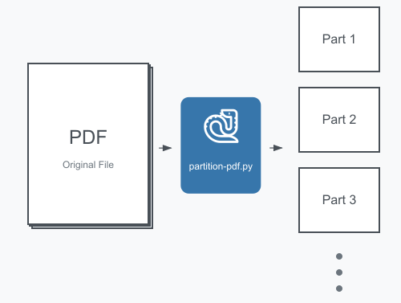

# PDF Partitioning Script



This script splits a PDF file into multiple smaller PDF files.

## Prerequisites

- Python 3.x
- PyPDF2 library

## Installation

1. Clone the repository or download the script.
2. Install the required library using pip:

    ```sh
    pip install PyPDF2
    ```

## Usage

1. Place the PDF file you want to split in the same directory as the script.
2. Edit the script to specify the input PDF file and the number of smaller PDFs you want to create:

    ```python
    input_pdf = 'GPO-J6-REPORT.pdf'
    num_files = 5  # Specify the number of smaller PDFs you want
    ```

3. Run the script:

    ```sh
    python partition-pdf.py
    ```

## Explanation

The script reads the input PDF file and splits it into the specified number of smaller PDF files. It uses the `PyPDF2` library to handle PDF operations.

### Function: `split_pdf`

```python
def split_pdf(input_pdf, num_files):
    # Read the input PDF file
    pdf = PdfReader(input_pdf)
    
    # Get the total number of pages in the PDF
    total_pages = len(pdf.pages)
    
    # Calculate the number of pages each smaller PDF should have
    pages_per_file = total_pages // num_files
    
    # Calculate any remaining pages that don't fit evenly
    remainder = total_pages % num_files

    # Loop through the number of smaller PDFs we want to create
    for i in range(num_files):
        # Create a new PDF writer for each smaller PDF
        pdf_writer = PdfWriter()
        
        # Calculate the start and end pages for this smaller PDF
        start_page = i * pages_per_file
        end_page = start_page + pages_per_file + (1 if i < remainder else 0)
        
        # Add the pages to the new PDF
        for page_num in range(start_page, end_page):
            pdf_writer.add_page(pdf.pages[page_num])
        
        # Create a name for the new PDF file
        output_filename = f"{os.path.splitext(os.path.basename(input_pdf))[0]}_{i+1}.pdf"
        
        # Save the new PDF file
        with open(output_filename, 'wb') as out:
            pdf_writer.write(out)
        
        # Print a message to say the new PDF was created
        print(f"Created: {output_filename}")